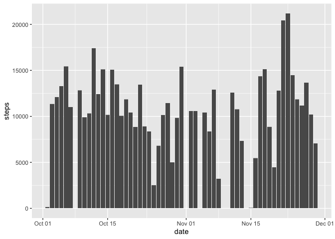
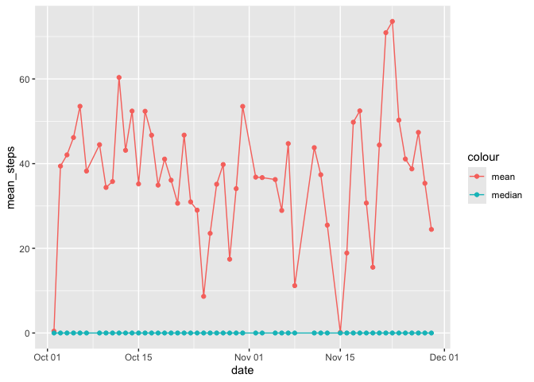
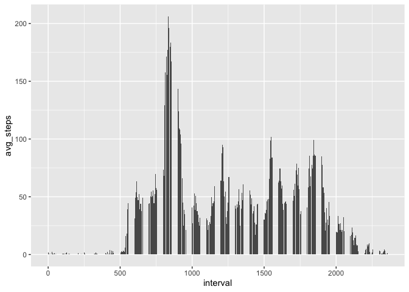
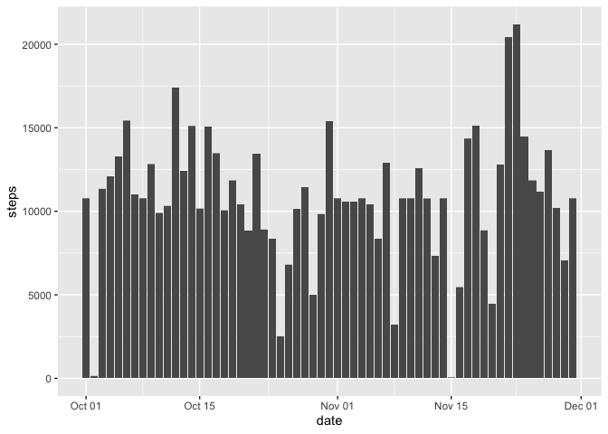
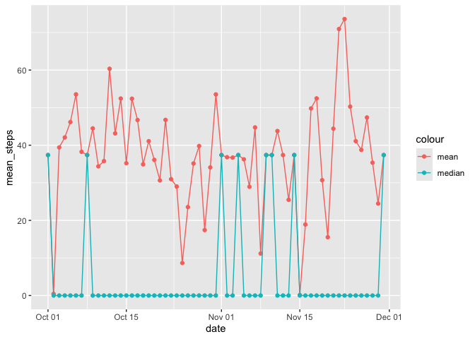
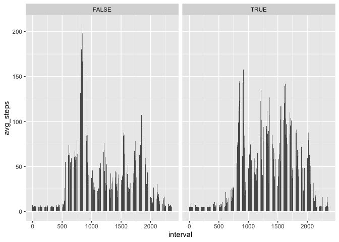
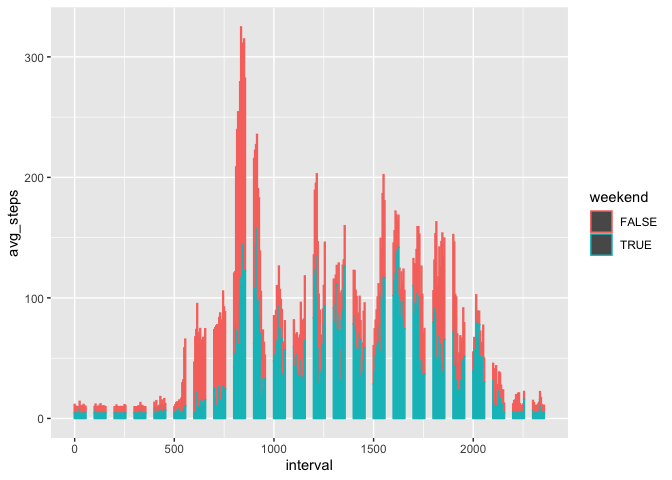

## Preparation


``` r
knitr::opts_chunk$set(echo = TRUE)

library(ggplot2)
library(lubridate)
```

```
## 
## Attaching package: 'lubridate'
```

```
## The following objects are masked from 'package:base':
## 
##     date, intersect, setdiff, union
```

``` r
library(dplyr)
```

```
## 
## Attaching package: 'dplyr'
```

```
## The following objects are masked from 'package:stats':
## 
##     filter, lag
```

```
## The following objects are masked from 'package:base':
## 
##     intersect, setdiff, setequal, union
```

``` r
library(tidyr)
```

## Loading and preprocessing the data

``` r
data_file <- "activity.csv"

if (!file.exists(data_file)) {
  unzip("activity.zip") 
}
```

Load the data; Process/transform the data (if necessary) into a format suitable for your analysis

``` r
raw_df <- tibble(read.csv(data_file)) %>%
  mutate(
    date=ymd(date),
    steps = as.numeric(steps),
  )

df <- raw_df %>%
  filter(steps != "NA") %>%
  print
```

```
## # A tibble: 15,264 × 3
##    steps date       interval
##    <dbl> <date>        <int>
##  1     0 2012-10-02        0
##  2     0 2012-10-02        5
##  3     0 2012-10-02       10
##  4     0 2012-10-02       15
##  5     0 2012-10-02       20
##  6     0 2012-10-02       25
##  7     0 2012-10-02       30
##  8     0 2012-10-02       35
##  9     0 2012-10-02       40
## 10     0 2012-10-02       45
## # ℹ 15,254 more rows
```

## What is mean total number of steps taken per day?

Calculate the total number of steps taken per day

``` r
steps_df <- df %>%
  group_by(date) %>%
  summarise(
    total_steps = sum(steps),
    mean_steps = mean(steps),
    median_steps = median(steps)
  ) %>%
  print
```

```
## # A tibble: 53 × 4
##    date       total_steps mean_steps median_steps
##    <date>           <dbl>      <dbl>        <dbl>
##  1 2012-10-02         126      0.438            0
##  2 2012-10-03       11352     39.4              0
##  3 2012-10-04       12116     42.1              0
##  4 2012-10-05       13294     46.2              0
##  5 2012-10-06       15420     53.5              0
##  6 2012-10-07       11015     38.2              0
##  7 2012-10-09       12811     44.5              0
##  8 2012-10-10        9900     34.4              0
##  9 2012-10-11       10304     35.8              0
## 10 2012-10-12       17382     60.4              0
## # ℹ 43 more rows
```

Make a histogram of the total number of steps taken each day

``` r
ggplot() + 
  geom_histogram(
    stat="identity",
    data=df,
    aes(
      x=date,
      y=steps,
    )
  )
```

```
## Warning in geom_histogram(stat = "identity", data = df, aes(x = date, y =
## steps, : Ignoring unknown parameters: `binwidth`, `bins`, and `pad`
```

<!-- -->

Calculate and report the mean and median of the total number of steps taken per day

``` r
ggplot(
  data=steps_df,
  aes(
      x=date,
      y=mean_steps,
      color="mean"
  )
) + 
  geom_point() +
  geom_line() +
  geom_point(aes(y=median_steps, color="median")) +
  geom_line(aes(y=median_steps, color="median"))
```

<!-- -->

## What is the average daily activity pattern?

Make a time series plot of the 5-minute interval (x-axis) and the average number of steps taken, averaged across all days (y-axis)


``` r
interval_df <- df %>%
  group_by(interval) %>%
  summarise(avg_steps=mean(steps)) %>%
  print
```

```
## # A tibble: 288 × 2
##    interval avg_steps
##       <int>     <dbl>
##  1        0    1.72  
##  2        5    0.340 
##  3       10    0.132 
##  4       15    0.151 
##  5       20    0.0755
##  6       25    2.09  
##  7       30    0.528 
##  8       35    0.868 
##  9       40    0     
## 10       45    1.47  
## # ℹ 278 more rows
```


``` r
ggplot(
  data=interval_df,
) + 
  geom_histogram(
    stat="identity",
    aes(
      x=interval,
      y=avg_steps,
    )
  )
```

```
## Warning in geom_histogram(stat = "identity", aes(x = interval, y = avg_steps, :
## Ignoring unknown parameters: `binwidth`, `bins`, and `pad`
```

<!-- -->

Which 5-minute interval, on average across all the days in the dataset, contains the maximum number of steps?


``` r
interval_df %>%
  filter(avg_steps==max(avg_steps)) %>%
  select(interval)
```

```
## # A tibble: 1 × 1
##   interval
##      <int>
## 1      835
```

## Imputing missing values

Calculate and report the total number of missing values in the dataset

``` r
raw_df %>%
  filter(is.na(steps)) %>%
  dim
```

```
## [1] 2304    3
```


``` r
imputed_df <- raw_df %>%
  mutate(across(steps, ~replace_na(., mean(., na.rm=TRUE)))) %>%
  print
```

```
## # A tibble: 17,568 × 3
##    steps date       interval
##    <dbl> <date>        <int>
##  1  37.4 2012-10-01        0
##  2  37.4 2012-10-01        5
##  3  37.4 2012-10-01       10
##  4  37.4 2012-10-01       15
##  5  37.4 2012-10-01       20
##  6  37.4 2012-10-01       25
##  7  37.4 2012-10-01       30
##  8  37.4 2012-10-01       35
##  9  37.4 2012-10-01       40
## 10  37.4 2012-10-01       45
## # ℹ 17,558 more rows
```

Make a histogram of the total number of steps taken each day and Calculate and report the mean and median total number of steps taken per day. Do these values differ from the estimates from the first part of the assignment? What is the impact of imputing missing data on the estimates of the total daily number of steps?

``` r
imputed_steps_df <- imputed_df %>%
  group_by(date) %>%
  summarise(
    total_steps = sum(steps),
    mean_steps = mean(steps),
    median_steps = median(steps)
  ) %>%
  print
```

```
## # A tibble: 61 × 4
##    date       total_steps mean_steps median_steps
##    <date>           <dbl>      <dbl>        <dbl>
##  1 2012-10-01      10766.     37.4           37.4
##  2 2012-10-02        126       0.438          0  
##  3 2012-10-03      11352      39.4            0  
##  4 2012-10-04      12116      42.1            0  
##  5 2012-10-05      13294      46.2            0  
##  6 2012-10-06      15420      53.5            0  
##  7 2012-10-07      11015      38.2            0  
##  8 2012-10-08      10766.     37.4           37.4
##  9 2012-10-09      12811      44.5            0  
## 10 2012-10-10       9900      34.4            0  
## # ℹ 51 more rows
```


``` r
ggplot() + 
  geom_histogram(
    stat="identity",
    data=imputed_df,
    aes(
      x=date,
      y=steps,
    )
  )
```

```
## Warning in geom_histogram(stat = "identity", data = imputed_df, aes(x = date, :
## Ignoring unknown parameters: `binwidth`, `bins`, and `pad`
```

<!-- -->


``` r
ggplot(
  data=imputed_steps_df,
  aes(
      x=date,
      y=mean_steps,
      color="mean"
  )
) + 
  geom_point() +
  geom_line() +
  geom_point(aes(y=median_steps, color="median")) +
  geom_line(aes(y=median_steps, color="median"))
```

<!-- -->

## Are there differences in activity patterns between weekdays and weekends?


``` r
imputed_interval_df <- imputed_df %>%
  mutate(weekend = wday(date, week_start=1) > 5) %>%
  group_by(interval, weekend) %>%
  summarise(avg_steps=mean(steps)) %>%
  print
```

```
## `summarise()` has grouped output by 'interval'. You can override using the
## `.groups` argument.
```

```
## # A tibble: 576 × 3
## # Groups:   interval [288]
##    interval weekend avg_steps
##       <int> <lgl>       <dbl>
##  1        0 FALSE        7.01
##  2        0 TRUE         4.67
##  3        5 FALSE        5.38
##  4        5 TRUE         4.67
##  5       10 FALSE        5.14
##  6       10 TRUE         4.67
##  7       15 FALSE        5.16
##  8       15 TRUE         4.67
##  9       20 FALSE        5.07
## 10       20 TRUE         4.67
## # ℹ 566 more rows
```


``` r
ggplot(
  data=imputed_interval_df,
) + 
  geom_histogram(
    stat="identity",
    aes(
      x=interval,
      y=avg_steps,
    )
  ) + facet_grid(.~weekend)
```

```
## Warning in geom_histogram(stat = "identity", aes(x = interval, y = avg_steps, :
## Ignoring unknown parameters: `binwidth`, `bins`, and `pad`
```

<!-- -->


``` r
ggplot(
  data=imputed_interval_df,
) + 
  geom_histogram(
    stat="identity",
    aes(
      x=interval,
      y=avg_steps,
      color=weekend
    )
  )
```

```
## Warning in geom_histogram(stat = "identity", aes(x = interval, y = avg_steps, :
## Ignoring unknown parameters: `binwidth`, `bins`, and `pad`
```

<!-- -->
